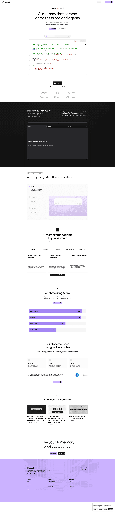

# DESIGN.md: mem0.ai

## Source
- URL: https://mem0.ai/
- Capture date: 2026-07-18
- Evidence: Firecrawl branding scrape (`.firecrawl/mem0-branding.json`), full-page screenshot (`.firecrawl/mem0-screenshot.png`), page markdown (`.firecrawl/mem0-landing.md`)

## Reference Screenshot

Use this screenshot as the visual source of truth for layout, hierarchy, density, and feel. Tokens below describe the same page in machine-readable form.

## Design Summary
Dense, engineered, typography-first SaaS landing page. White background with near-black text, one full-bleed inverted black band for contrast, and a soft lavender accent. Almost no decorative shadows or large radii — structure comes from thin 1px borders, card grids, tab rows, and uppercase monospace eyebrow labels. Sections are compact: big semibold heading, one short sentence, then a structured grid. Nothing floats free.

## Design Tokens

### Colors
- Background: `#FFFFFF` (observed)
- Text primary: `#121212` (observed)
- Accent / primary: `#CBB2FF` soft lavender (observed)
- Secondary accent: `#0066FF`, link blue `#0000EE` (observed)
- Inverted band: near-black `#0A0A0A` bg, white text (observed in screenshot)
- Borders: light gray ~`#E5E5E5` (inferred from screenshot)
- Footer: pale lavender tint of the accent (observed)

### Typography
- Headings: **Fustat SemiBold** (observed; available on Google Fonts). Fallback: `Fustat, sans-serif`.
- Body: Fustat Medium, small — body copy ~14px (observed).
- Labels/eyebrows/code: **DM Mono**, uppercase, letter-spaced (observed).
- Scale: h1/h2 up to 64px desktop, h3 ~24px card titles, body 14px. Tight leading (~1.1 on display sizes).

### Spacing And Layout
- Base unit 4px (observed); border radius tiny — 0–4px on cards and buttons (observed).
- Container ~1200px, generous side padding, but **short vertical rhythm**: sections ~64–96px apart, header-to-content gap ~40px (inferred from screenshot).
- No box shadows; flat surfaces separated by 1px borders (observed).

## Components
- **Buttons**: small, rectangular (4px radius), flat. Primary = accent bg; secondary = black bg white text. Arrow glyph suffix on CTAs.
- **Eyebrow label**: DM Mono, ~12px, uppercase, tracked out, muted color; sometimes a tiny badge with 1px border ("New Algorithm").
- **Cards**: white bg, 1px border, 4px radius, ~24px padding, title + small muted body. Used in 3-col grids.
- **Tab row**: horizontal text tabs with active underline (use-case switcher).
- **Section header**: small icon or eyebrow centered above, 2-line semibold heading, one short muted sentence.
- **Inverted band**: black section with white heading, muted gray body, accent-colored highlights, dark cards inside.
- **Footer**: pale lavender, multi-column link grid, big wordmark.

## Page Patterns
Order: nav → compact hero (headline + CTA + code/product proof) → logo strip → black "built for developers" band → "How it works" 3-step panel → use-case tab grid → benchmark band with accent bars → enterprise 3-col feature row → blog card grid → lavender footer. Alternates white / black / white; every section is a header + structured grid, never floating paragraphs.

## Content Style
Short declarative headlines ("AI memory that persists across sessions and agents"). One-sentence subcopy. CTAs: "Get Started", "See Pricing", "Talk to our team". Uppercase mono nav items (DEVELOPERS, PRICING, RESOURCES).

## Agent Build Instructions
1. Load Google Fonts `Fustat` (500/600/700) and `DM Mono` (400/500); headings Fustat semibold, eyebrows DM Mono uppercase tracked.
2. Keep vertical padding tight: `py-16`–`py-24` per section, `mb-10`–`mb-12` after section headers.
3. Replace free-floating text lists with bordered card grids (`border`, `rounded` ≤6px, no shadow, ~p-6).
4. Add one inverted dark band section for contrast; use the brand accent inside it.
5. Eyebrow + heading + one-line subtext pattern above every section grid.
6. Buttons: compact, small radius, flat; arrow suffix on primary CTA.
7. Do not reuse mem0's logo, imagery, or copy — tokens and layout patterns only.

## Rerun Inputs
workflow: firecrawl-website-design-clone
source_url: https://mem0.ai/
target_stack: React + Vite + Tailwind (NextStepConnect)
output: DESIGN.md
